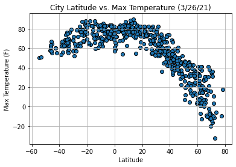
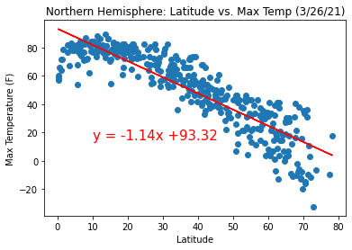
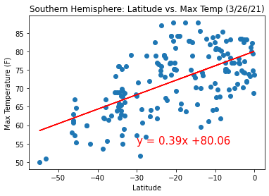
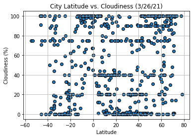
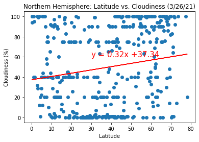
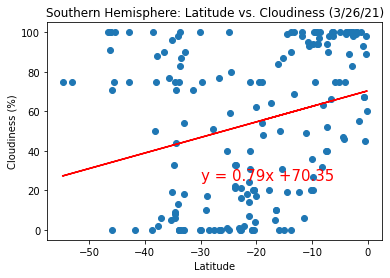
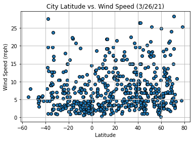
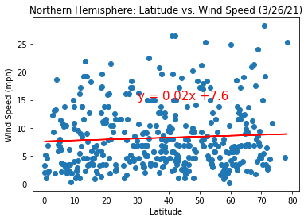
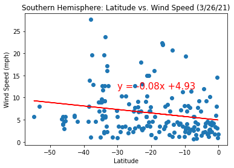

# python-api-challenge

## Description
OpenWeatherMap API was used to pull weather data on randomly selected cities and the dataset was used to observe weather trends as we approach the equator. Google Places API was used to create a heatmap of the cities by humidity and to identify hotel locations based on set weather conditions.

## How to Run Code
Clone this repository and run code in the WeatherPy or VacationPy Jupyter notebook.

## Results
Below are three insights drawn from the weather dataset for 500+ randomly selected cities that was pulled on 3/26/21:

1. The maximum temperature increases as we approach the equator. This conclusion is supported by the scatter plot of city latitude versus maximum temperature as shown below.

    

    The linear regression models for maximum temperature in northern hemisphere (r-value = 0.8) and southern hemisphere (r-value = 0.4) further supports the conclusion above as we see the maximum temperature decrease with increasing latitude in the northern hemisphere and the maximum temperature increase with increasing latitude in the southern hemisphere.

    

    

2. There is no significant trend observed for cloudiness versus latitude. The scatter plot of city latitude versus cloudiness below shows that cloudiness can range from 0% to 100% for cities in the dataset regardless of the location of the city. 

    

    The r-values for latitude versus cloudiness in the northern hemisphere (0.031) and southern hemisphere (0.076) were both very low, which indicates that there is a lot of variability from the fitted regression lines shown below. This further suggests the independence of cloudiness from latitude.

    

    

3. There is no significant trend observed for wind speed versus latitude. The scatter plot of city latitude versus wind speed below shows that the wind speed is generally below 20 mph for the cities in the dataset regardless of the location of the city.  

    

    The r-values for latitude versus wind speed in the northern hemisphere (0.004) and southern hemisphere (0.043) were both very low, which indicates that there is a lot of variability from the fitted regression lines shown below. This further suggests the independence of wind speed from latitude.
    
    

    